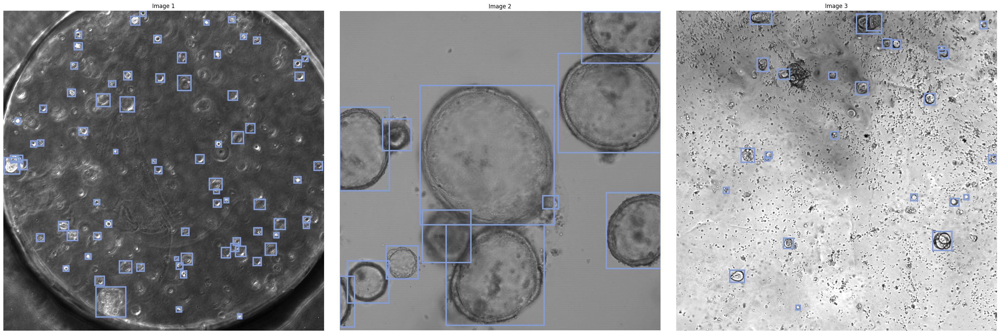
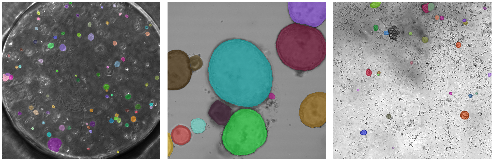
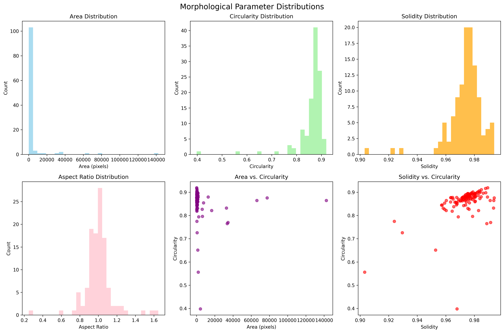

# OrgLine: An AI-Driven Versatile Pipeline for Organoid with a Foundation Model

**Authors:**  
Xun Deng¹'², Xinyu Hao³, Thomas Herget⁴, Mei Gao⁵, Mathias Winkel⁶, Feng Tan⁶, Lun Hu¹'², and Pengwei Hu¹'²*

¹ The Xinjiang Technical Institute of Physics and Chemistry, Chinese Academy of Sciences, Urumqi, China  
² University of Chinese Academy of Sciences, Beijing, China  
³ Peking University Third Hospital, Beijing, China  
⁴ Science and Technology Office, Merck KGaA, Darmstadt, Germany  
⁵ Chongqing General Hospital, Chongqing University, Chongqing, China  
⁶ AI and Quantum Lab, Merck KGaA, Darmstadt, Germany  

*Correspondence: hpw@ms.xjb.ac.cn

---

<p align="center">
  
</p>

## 📝Introduction

OrgLine, the first multitask analysis pipeline for organoids, leverages a pretrained detector and a vision foundational model to facilitate large-scale automated cultivation and analysis of organoids. OrgLine achieves precise localization, counting, classification, and segmentation of organoids, providing a foundational and efficient analytical support system.

## 📦Getting Started


---

### • Environment Setup Configuration

Automatic environment setup, please be patient.

```bash

# This creates an isolated environment to avoid conflicts with existing packages
conda create -n orgline_env python=3.10

# This switches to the OrgLine environment for package installation
conda activate orgline_env

# Git is required to clone the repository from GitHub
conda install git

# This downloads the complete source code to your local machine
git clone https://github.com/ucas-dx/OrgLine.git

# Change to the project directory containing all necessary files
cd OrgLine

# This installs the package and its dependencies while allowing local modifications
pip install -e .
```

### • Image Format Support Configuration

Additional packages required for specialized microscopy image formats.

```bash

# Standard image formats (JPEG, PNG, BMP) are supported by default
# For specialized microscopy formats, additional packages are required

# TIFF format support - Enhanced TIFF reading capabilities
pip install tifffile

# CZI format support - Carl Zeiss microscopy image format
pip install czifile

# ND2 format support - Nikon microscopy image format (choose one option)
pip install nd2
# OR alternatively
pip install nd2reader

# Additional scientific image format support (optional)
pip install imageio-ffmpeg  # For video formats and advanced codecs
pip install pillow-simd     # Faster image processing (alternative to standard Pillow)

# Bio-formats support for comprehensive microscopy format compatibility
pip install python-bioformats  # Requires Java runtime environment

```

**Supported Image Formats:**
- **Standard formats**: JPEG, PNG, BMP, GIF (built-in support)
- **TIFF**: Enhanced support with `tifffile` package
- **CZI**: Carl Zeiss microscopy format with `czifile` package  
- **ND2**: Nikon microscopy format with `nd2` or `nd2reader` package
- **Additional**: Many other formats via `python-bioformats` (requires Java)
---
### • Dataset Organization

Properly organize your organoid datasets for training and inference by following this directory structure:
```bash
datasets/
└── Intestine/                # Replace 'Intestine' with your dataset name (e.g., Brain, Lung, Colon)
    ├── train/                # Training set
    │   ├── images/           # Training images
    │   ├── labels/           # Bounding box annotations (YOLO format) for training images
    │   └── masks/            # Instance segmentation masks for training images
    ├── val/                  # Validation set
    │   ├── images/           # Validation images
    │   ├── labels/           # Bounding box annotations for validation images
    │   └── masks/            # Segmentation masks for validation images
    └── test/                 # Test set
        ├── images/           # Test images
        ├── labels/           # Bounding box annotations for test images (optional)
        └── masks/            # Segmentation masks for test images (optional)

**Note:**  
- You can replace `Intestine` with any dataset name such as `Brain`, `Lung`, `Colon`, etc., depending on your organoid type.  
- Each dataset should follow the same internal structure with `images`, `labels`, and `masks` subdirectories.  
- The `labels/` directory stores YOLO-format bounding box annotations.  
- The `masks/` directory stores instance segmentation masks.  
- The `test/labels/` and `test/masks/` directories are optional and can be omitted if not needed.
```

### • Model Selection

* **Standard**

  * **Config**: `orgline/cfg/models/our_model/orgline.yaml` (load via **ORGDET**; optional `orgdet_tiny_pan.yaml`)
  * **Detector weights**: `orgdet.pt` 
  * **Best for**: ample VRAM, highest accuracy

* **Low‑VRAM**

  * **Config**: same as above, or `orgdet_tiny_pan.yaml`
  * **Detector weights**: `orgdet_tiny.pt` **Download**: [Direct Link](https://drive.google.com/file/d/169OIs_wCGidXcbe5g6u3kWcji3PKhlmW/view?usp=sharing)
  * **Best for**: limited VRAM, quick prototyping

  
## 🚀 OrgLine: Quick Usage Guide

OrgLine provides comprehensive support for both inference and fine-tuning capabilities. The system allows for domain-specific adaptation through fine-tuning of the organoid detector (OrgDet) and the mask decoder component of OrgLine. This flexibility enables researchers to optimize the pipeline performance for their specific organoid types and experimental conditions, ensuring robust and accurate analysis across diverse biological contexts.For detailed instructions on OrgLine inference and fine-tuning procedures, please refer to our comprehensive Jupyter notebook tutorials:

You can run the contents of the [OrgDet_inference_and_finetune.ipynb](OrgDet_inference_and_finetune.ipynb)


### • 📖 OrgLine Inference and OrgDet Fine-tuning Tutorial
This notebook provides step-by-step guidance for:
#### • Running inference with pre-trained models
- **Step 1**: Generate detection bounding boxes and classifications
&nbsp;
  ```bash
  from orgline import ORGDET
  model = ORGDET(r'orgline/cfg/models/our_model/orgline.yaml') # select your model.pt path,you can also use 'orgdet_tiny_pan.yaml'
  from orgline.weights_merge import merge_and_load_model_weights
  loaded_model = merge_and_load_model_weights(
    model=model,
    lightweight_path='orgdet.pt',          # Path to lightweight weights ,you can also use 'orgdet_tiny.pt'
    sam_path='sam2_hiera_large.pt',        # Path to SAM2 weights,if you use 'orgdet_tiny.pt', you can use 'sam2_hiera_tiny.pt'
    verbose=True,
    save_path='weights/orgdet_complete_merged.pt')# Whether to show detailed info)

  root_path = r'datasets' + '\\' + data_name + '\\' + r'train\images'
  out = model.predict(
      source=root_path,
      project='runs',
      name='exp',
      save=True,
      visualize=False,  # visualize model feature maps
      save_conf=True,
      save_txt=True,
      conf=0.2,
      iou=0.7)
  ```    
<p align="center">

</p>

- **Step 2**: Use bounding boxes as prompts, mask decoder outputs instance segmentation results
&nbsp;
  ```bash
  from orgline.build_model import load_sam2_pretrained
  predictor = load_sam2_pretrained(
    model_name="hiera_large",                 # Choose the model size/variant, e.g., "hiera_large",you can also use "hiera_tiny"
    config_dir=r'orgline/sam2_configs')        # Path to the directory with config files

  with torch.no_grad():
    predictor.set_image(img)
    transformed_boxes = input_boxes
    masks, _, _ = predictor.predict(
        point_coords=None,
        point_labels=None,
        box=transformed_boxes,
        multimask_output=False,)

  ```
<p align="center">

</p>

- **Step 3**: Output morphological analysis data for each image&nbsp;
  ```bash
    from orgline.utilseg import calculate_morphological_statistics, create_morphology_visualizations
    df_morphology = calculate_morphological_statistics(out_mask) #save as csv
    create_morphology_visualizations(df_morphology, "morphology_analysis")
  ``` 
<p align="center">

</p>

- **Step 4**: Convert segmentation masks to FIJI/ImageJ ROI sets and generate a summary report
  ```bash
  from orgline.utilseg import masks_to_fiji_rois, create_summary_report
  print("Converting masks to FIJI ROIs...")
  masks_to_fiji_rois(out_mask)
  print("\nCreating summary report...")
  create_summary_report(out_mask)
  print("\nConversion completed!")
  ``` 

#### OrgDet Fine-tuning Tutorial
Fine-tune the model by loading merged weights and training on your custom dataset with configurable parameters such as project name, data path, hyperparameters, augmentation, and device settings.
```bash
model.train(
    project='train_runs' + data_name,
    data=train_path,
    imgsz=1280,
    epochs=30,
    batch=3,
    close_mosaic=10,
    workers=0,
    device='0',
    optimizer='Adam',  # using Adam or SGD optimizer
    lr0=0.001,
    lrf=0.01,
    freeze=[0, 1, 2, 3, 4, 5],
    Distillation=None,
    loss_type=None,
    exist_ok=True )
``` 
### • 📖 OrgLine Mask Decoder Fine-tuning Tutorial
This script prepares data loaders and starts model training for the OrgLineSeg (SAM2-based) segmentation task. It supports various configuration options, such as batch size, augmentation, learning rate, early stopping, etc .The script will load the dataset, set up training and validation splits, and handle the training loop.
You can run the contents of the [OrgLine_mask_finetune.ipynb](OrgLine_mask_finetune.ipynb)
#### • Data Preparation
```bash
# Create data loaders externally
from orgline.train_data import create_dataloaders
from orgline.trainer import train_orglineseg_model
# Define the dataset classes available
data_cls = ['Intestine', 'brain', 'colon', 'PDAC']
data_name = data_cls[0]  # Select the dataset to use (here: 'Intestine')
root_path = r'datasets'  # Path to the dataset root directory
train_loader, val_loader = create_dataloaders(
    root_path="datasets",
    data_name="Intestine", 
    type_T='train',            # Use the 'train' split
    batch_size=8,              # Number of samples per batch
    num_workers=0,             # Number of DataLoader worker processes
    image_size=512,            # Resize images to 512x512
    max_instances=16,          # Max number of instances per image
    train_augment=True,        # Enable training data augmentation
    train_size=0.8,            # Training/validation split ratio
    use_albumentations=True,   # Use albumentations for augmentation
    disable_augment_after_epoch=15   # Disable augmentation after 15 epochs
)
```

#### • Training the Mask Decoder for Orgline
```bash
custom_config = {
    'num_epochs': 30,          # Number of training epochs
    'lr': 1e-4,                # Learning rate
    'accumulate_steps': 4,     # Gradient accumulation steps
    'patience': 1000,          # Early stopping patience (steps)
    'gamma': 0.995             # Learning rate decay factor (ExponentialLR)
}
results = train_orglineseg_model(
    predictor=predictor,       # The SAM2 predictor/model to train
    train_loader=train_loader,
    val_loader=val_loader,
    config=custom_config       # Pass custom training configuration
```
## ⚖️License
OrgLine is released under the [MIT License](MIT-License.txt), a permissive open-source license that allows for free use, modification, distribution, and private use of the software. This license requires that the original copyright notice and permission notice be included in all copies or substantial portions of the software.

## 📃Citation

If you use this codebase in your research or project, please cite:

Deng, X., Hao, X., Herget, T., Gao, M., Winkel, M., Tan, F., Hu, L., & Hu, P. (2025). OrgLine [Computer software]. https://github.com/ucas-dx/OrgLine
